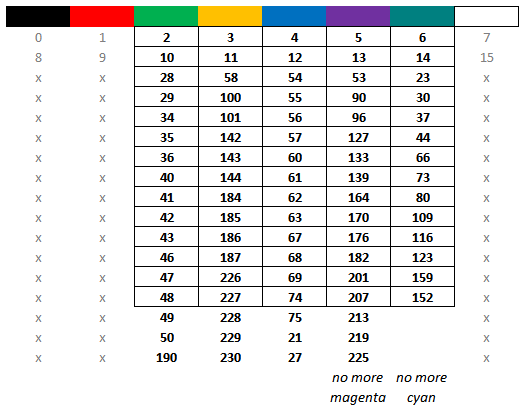

# Palette selection for prompt

Here is what 256 color palette looks like in terminal

And this is what we get if the terminal is only able to display 8 colors

Based on the images above I selected some colors from 256 palette in such way
that basic 8 colors would be equally represented in case of downgrade. Red,
white and black were not selected because I do not use them in prompts. Even
after that magenta is somewhat underrepresented (3 entries less than any other
color) because it just does not appear anymore in the downgraded palette.

